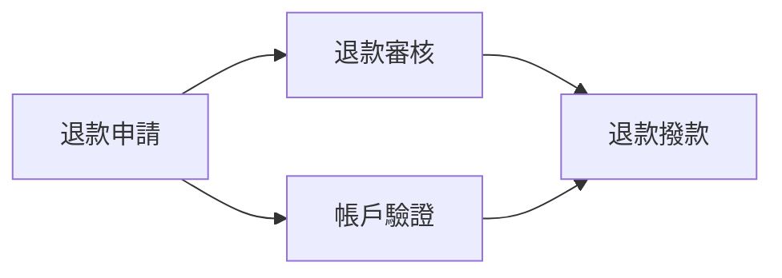

# 後端開發規格（POC）

## 1. 目的與範圍

使用者以 API 提交純文字需求，AI 將需求拆成具有先後相依關係的 Workflows，再根據各 Workflow 的名稱、描述與全系統共用的組織表（GlobalMemory）決定部門歸屬。使用者可以修正結果，單人確認後結案。系統分析最終結果及修改歷程，改善後續使用的組織職能描述。

POC 採單一組織環境、單一後端服務及 PostgreSQL。登入、角色權限、多人簽核、結案重開、需求替換及專案刪除不在本次範圍。API 不接受實體檔案，也不需要檔案儲存服務。

以下未由產品需求指定的 API、限制及執行方式，均為本文件採用的 POC 預設。每個 Workflow 暫定只能歸屬一個部門；尚未判定時為「未歸屬」，無法判定時可明確標記「不知道」，不強制分類。

## 2. 名詞與資料模型

所有 ID 採 UUID，時間採 UTC ISO 8601，資料保存於 PostgreSQL。除明列可為 null 的欄位外，欄位均必填。

| 名詞 | 定義與主要欄位 |
|---|---|
| Project | 專案。`id`、`name`、`status`（OPEN / CLOSED）、`createdAt`、`closedAt`（可為 null）。一個專案只有一份 UserDoc 及一份 Report。 |
| UserDoc | 需求文字。`projectId`（唯一）、`content`、`createdAt`。保存 API body 的文字內容，不是檔案。建立後不允許替換。 |
| Report | Workflow 集合的報告。`id`、`projectId`（唯一）、`version`、`createdAt`、`updatedAt`。不另存一份可獨立編輯的報告文字；讀取時組合其 Workflows。 |
| Workflow | 工作任務。`id`、`reportId`、`name`、`description`、`dependsOnWorkflowIds`（UUID 陣列，不可為 null）、`assignmentStatus`（UNASSIGNED / ASSIGNED / UNKNOWN）、`departmentId`（可為 null）、`assignmentSource`（AI / USER / null）、`createdAt`、`updatedAt`。 |
| Department | 組織表內的部門。`id`、`name`、`description`。部門 ID 在不同 GlobalMemory 版本之間保持一致。 |
| GlobalMemory | 全系統共用且保留歷史的組織表。`version`（從 1 遞增）、`departments`、`relationshipsDescription`（字串）、`source`（INITIAL / FEEDBACK）、`sourceProjectId`（初始版本為 null）、`createdAt`。 |
| ReportDiff | 不可修改的報告事件及差異，結構見第 5 節。 |
| Job | AI 任務。`id`、`projectId`、`type`、`status`、`attempts`、`maxAttempts`、`nextRetryAt`（可為 null）、`globalMemoryVersion`、`inputReportVersion`、`error`（可為 null）、`createdAt`、`startedAt`（可為 null）、`finishedAt`（可為 null）。 |

### Report 與 Workflow

- 建立專案時一併建立空 Report，初始 `version = 0`；首次分析成功後新增 Workflows。
- Report 對應零到多個 Workflows。API 的 workflows 陣列以相依關係做拓撲排序，前置工作一定出現在依賴它的工作之前；每一步從前置工作皆已輸出的候選工作中，依 `createdAt`、`id` 升冪選取。陣列順序用於穩定呈現，實際先後限制以 dependsOnWorkflowIds 為準，沒有相依的項目不因陣列位置而被視為必須依序執行。
- 歸屬使用下表三種狀態；「不知道」是 Workflow 的判定結果，不是 GlobalMemory 裡的虛擬部門。
- 手動指定部門或標記不知道時來源為 USER；AI 判定時來源為 AI，即使部門與先前相同也是如此。清除判定時來源為 null。
- AI 只能選擇本次 GlobalMemory 中存在的部門。名稱、描述或組織職能不足以支持判定、存在多個無法區分的候選部門，或沒有適合部門時，必須回傳 UNKNOWN 與 null departmentId，不得為了填滿歸屬而猜測。手動歸屬也必須參照有效部門 ID。
- 修改名稱或描述不會自動觸發 AI，也不會自動清除既有歸屬；使用者可同時清除歸屬或另行要求全部重新分析。
- 首次分析必須產生 1–200 個 Workflows；手動操作後可為零個，上限同樣為 200 個。

| assignmentStatus | 顯示名稱 | departmentId | assignmentSource | 意義 |
|---|---|---|---|---|
| UNASSIGNED | 未歸屬 | null | null | 尚未判定或已清除先前判定。 |
| ASSIGNED | 已歸屬 | 有效部門 UUID | AI / USER | 已指定部門。 |
| UNKNOWN | 不知道 | null | AI / USER | 已判定無法確定部門，不強制分類。 |

API、資料庫與 AI 結果驗證均須維持上表組合。只看 departmentId 是否為 null 無法區分 UNASSIGNED 與 UNKNOWN，回應必須包含 assignmentStatus。

### Workflow 相依關係

- `dependsOnWorkflowIds` 保存此工作直接依賴的前置 Workflow ID。B 的陣列包含 A，表示 **A 必須完成後，B 才能開始**；圖上的箭頭方向為 A → B。
- 可有多個前置工作，全部完成後才可開始；同一工作也可被多個後續工作依賴。沒有前置工作時回傳 `[]`。彼此不存在直接或間接相依的工作，在本規格的相依限制下可並行。
- 僅允許同一 Report 內的相依，禁止不存在或已刪除的 ID、跨專案參照、自我相依、重複 ID，以及直接或間接循環，例如 A → B → A。
- 整份 Report 必須是一張有向無環圖（DAG），可有多個起點、終點或互不連接的分支，不強制形成單一路線。相依陣列視為集合，回應及快照按 UUID 升冪排序；只調整陣列順序不算變更。
- `[]` 表示目前沒有已建立的前置限制，不代表系統已證明該工作在真實業務中獨立。AI 僅建立需求文字足以支持的相依，不確定時不臆造，供使用者後續補充。
- 相依關係與部門歸屬獨立；UNASSIGNED 或 UNKNOWN 的工作仍可有前置及後續工作。修改名稱、描述或歸屬不自動修改相依；修改相依也不自動重新歸屬。
- 此處定義報告中的業務先後關係。POC 不追蹤每個 Workflow 的實際執行進度、不自動排程，也不因相依關係而要求各 Workflow 實際完成才可簽核報告。
- 資料庫以 WorkflowDependency 關聯表保存邊，欄位為 `reportId`、`workflowId`、`dependsOnWorkflowId`；兩個 Workflow 均以同 Report 的外鍵約束連結，邊唯一、自我相依禁止。刪除被依賴的 Workflow 使用 RESTRICT；刪除允許移除的 Workflow 時同步移除其自身的前置關聯。
- 後端在鎖定所屬專案的同一交易內驗證完整圖無循環，再提交相依變更、Report 版本與 ReportDiff，避免並行請求各自通過卻合併出循環。

例如「退款申請」完成後，「退款審核」與「帳戶驗證」可以並行；「退款撥款」必須等待兩者：



### GlobalMemory 初始化與更新

- 使用者在第一次分析前，以 API 提供初始組織表，全系統共用；未初始化時不得建立專案或送出分析。
- 初始資料含非空 `departments` 陣列及 `relationshipsDescription`，後者可為空字串。部門 ID 不得重複。
- 使用者稍後提供實際組織內容與部門關係。本版將關係保留為文字，不預設樹狀階層或結構化關係模型。
- POC 初始化僅允許一次。後續回饋可改善各部門 `description`，不能新增、刪除、改名部門，也不能修改部門 ID 或 `relationshipsDescription`。
- 每次成功回饋建立新版本，保留舊版本；最新已提交版本供後續分析使用，不回溯修改既有 Report。

## 3. 操作規則

### 建立專案與首次分析

`POST /api/v1/projects` 同時接收專案名稱與需求文字，建立 Project、UserDoc、空 Report 及 INITIAL_ANALYSIS 任務，回傳 202。

AI 先根據 UserDoc 拆出 Workflow 名稱、描述與相依關係，再僅根據各 Workflow 的名稱、描述及本次 GlobalMemory 決定歸屬；相依關係及前置工作的部門不作為歸屬判定的額外依據。首次分析成功前，禁止手動修改、其他分析及結案；失敗時可透過任務重試 API 重新執行。

### 全部重新分析歸屬

- 僅重新決定既有 Workflows 的部門，不新增、刪除或修改 Workflow 的 ID、名稱、描述及 dependsOnWorkflowIds。
- **清除所有既有部門歸屬，包含使用者手動指定的歸屬。** 接受請求時，在同一資料庫交易內將所有 Workflow（包含 UNKNOWN）重設為 UNASSIGNED、departmentId 與 assignmentSource 設為 null、記錄差異並建立 ALL_REANALYZE 任務。
- 舊歸屬、舊 ReportDiff 及請求的 `reason` 不作為本次歸屬依據；reason 僅供記錄及結案後回饋使用。
- AI 結果全部驗證成功後，在同一交易內寫入歸屬及 ReportDiff，不部分套用。
- AI 失敗時保留清除後的未歸屬狀態，不恢復手動或 AI 舊歸屬；系統按第 6 節重試。
- 沒有 Workflow 時回傳 409 `NO_WORKFLOWS`，不建立任務。

### 僅分析未歸屬項目

- 接受請求時選取所有 assignmentStatus 為 UNASSIGNED 或 UNKNOWN 的 Workflows，保存目標 ID、名稱及描述快照。因此「不知道」也能由此操作再次判定。
- 僅分析並更新這些項目的歸屬；已有部門歸屬的項目一律保留，所有 Workflow 的 dependsOnWorkflowIds 均不變。
- 沒有未歸屬項目時回傳 409 `NO_UNASSIGNED_WORKFLOWS`，不建立任務。
- AI 可以再次回傳 UNKNOWN；這是有效分析結果，不等於任務失敗，也不會因此自動重試。此操作不預先清除目標的原狀態，執行失敗時維持原 UNASSIGNED 或 UNKNOWN。

### 手動儲存變更

- Workflow 新增、編輯、刪除各自透過 API 即時儲存，不另設「儲存整份 Report」API。
- 每次實際變更與 ReportDiff 在同一資料庫交易寫入；批次分析也以同一交易提交其全部結果。
- 若有其他 Workflow 直接依賴待刪除的工作，回傳 409 `WORKFLOW_HAS_DEPENDENTS`，error.details 包含按 UUID 升冪排列的 `dependentWorkflowIds`。使用者須先修改這些工作的 dependsOnWorkflowIds，再以最新 Report 版本刪除；不自動解除其他工作的前置限制。
- 允許刪除時，同一交易移除該工作及其自身的前置關聯；ReportDiff 仍保存刪除前含 dependsOnWorkflowIds 的完整快照。
- 欄位完全沒有變動時回傳原結果，不遞增版本、不產生多餘差異。

### 單人簽核結案

- 一位操作者呼叫完成 API 即視為取得共識，不需要其他人核准。
- 首次分析成功、至少有一個 Workflow 且沒有進行中的報告分析任務時，可以結案。允許仍有 UNASSIGNED 或 UNKNOWN 項目，由簽核者接受此結果；沒有 Workflow 時回傳 409 `NO_WORKFLOWS`。
- 在同一交易內將 Project 設為 CLOSED、記錄 `closedAt`、記錄結案事件，保存最終 Report 與完整 ReportDiff 快照，並建立 FEEDBACK 任務。
- 結案後禁止修改專案、UserDoc、Workflow、再次分析報告，以及重試舊報告分析任務。
- **結案狀態與回饋分析成功與否獨立。** FEEDBACK 失敗不撤銷結案，依任務機制重試。
- 重複結案回傳原本的結案結果及同一個 FEEDBACK 任務，不新增回饋；每個專案只允許一個 FEEDBACK 任務。

### 回饋分析

- 輸入為結案時最終 Report（含 Workflows）、完整 ReportDiff，以及執行時最新的 GlobalMemory。
- AI 分析人工與 AI 調整歷程；UNKNOWN 表示未能判定，不得把它當成某部門的已確認歸屬。回饋僅改善部門職能描述；輸出必須包含全部原部門且通過 ID、名稱與數量不變的驗證。
- 多個專案的 FEEDBACK 依結案時間逐一處理，同時最多一個執行。等待重試的回饋可讓其他已就緒回饋先執行。
- 每次回饋嘗試讀取當時最新 GlobalMemory 並記錄版本；提交時確認版本未改變，衝突則重新讀取並重試，不得覆蓋其他已完成回饋。
- 新 GlobalMemory 版本、FEEDBACK 成功狀態與專案回饋唯一紀錄須同一交易提交。以 `sourceProjectId` 唯一約束避免同一專案回饋重複生效。

## 4. 狀態、版本與並行

| 對象 | 狀態與規則 |
|---|---|
| Project | OPEN → CLOSED，不可逆。 |
| Job | QUEUED → RUNNING → SUCCEEDED；可重試失敗為 RUNNING → RETRY_WAIT → RUNNING；不可重試或耗盡次數則為 FAILED。手動重試為 FAILED → QUEUED。 |
| 進行中任務 | QUEUED、RUNNING、RETRY_WAIT 均視為進行中。FAILED、SUCCEEDED 為終止狀態。 |

- Job type 為 INITIAL_ANALYSIS、ALL_REANALYZE、UNASSIGNED_ANALYZE 或 FEEDBACK；前三者統稱報告分析。
- 同一專案最多一個進行中的報告分析任務；不同專案可各自分析。
- 報告分析進行中時，拒絕手動修改、其他分析及結案，回傳 409 `PROJECT_BUSY`；可正常讀取報告及任務狀態。
- 所有 Report 寫入及任務提交都須在交易中鎖定專案並檢查狀態與版本，避免編輯、結案、分析同時通過檢查。
- 手動變更、分析請求及結案請求必須帶 `expectedReportVersion`；與當前版本不同時回傳 409 `REPORT_VERSION_CONFLICT`。
- 每個 Report 事件遞增一次版本並對應一筆 ReportDiff；一筆可含多個 Workflow 差異。全部重新分析的清除與結果套用是兩個事件。
- 即使沒有欄位改變，清除、分析完成與結案仍記錄事件，`changes` 可為空陣列；失敗嘗試只記錄在 Job，不新增 ReportDiff。
- 報告分析使用接受請求時的 GlobalMemory 版本及 Workflow 快照，所有自動重試沿用該輸入。結果提交前須確認任務執行權及 Report 版本仍相符。
- 全部重新分析任務的 `inputReportVersion` 是清除完成後的版本；其餘報告分析為接受請求時的版本。

## 5. ReportDiff 格式

| 欄位 | 說明 |
|---|---|
| `id`、`projectId`、`reportId` | 唯一 ID 及所屬資源。 |
| `eventType` | INITIAL_ANALYSIS / WORKFLOW_CREATED / WORKFLOW_UPDATED / WORKFLOW_DELETED / ALL_REANALYZE / UNASSIGNED_ANALYZE / PROJECT_CLOSED。 |
| `phase` | CLEAR / APPLY。僅 ALL_REANALYZE 的清除事件為 CLEAR，其餘皆 APPLY。 |
| `source`、`actorId` | USER / AI / SYSTEM；POC 不驗證身分，actorId 固定為 null。手動操作與結案為 USER，清除為 SYSTEM，AI 結果為 AI。 |
| `reason` | 使用者提供的理由，可為 null；全部重新分析必填。 |
| `jobId` | 關聯任務 ID，無關聯任務時為 null。 |
| `globalMemoryVersion` | AI 任務採用的組織表版本，非 AI 事件可為 null。 |
| `fromVersion`、`toVersion` | Report 事件前後版本，`toVersion = fromVersion + 1`。 |
| `changes` | 差異陣列，每項包含 `workflowId`、`operation`（CREATE / UPDATE / DELETE）、`changedFields`、`before`、`after`。 |
| `createdAt` | 事件時間。 |

before / after 為完整 Workflow 快照，包括 ID、Report ID、名稱、描述、dependsOnWorkflowIds、assignmentStatus、部門、來源及建立／更新時間；UNASSIGNED、ASSIGNED、UNKNOWN 之間的轉換也須記錄。CREATE 的 before 為 null；DELETE 的 after 為 null；UPDATE 兩者皆存在。changedFields 列出實際不同的欄位；新增／刪除列出快照全部欄位。

相依變更使用 WORKFLOW_UPDATED 事件，changes 中的 changedFields 包含 dependsOnWorkflowIds；只改相依也須遞增 Report 版本。首次分析的 CREATE 快照包含完整相依 ID；若驗證失敗，整筆操作不修改 Workflow、Report 版本或 ReportDiff。

ReportDiff 僅能新增及讀取。Job 另外保存每次執行嘗試的批次、次數、開始／結束時間、輸入組織表版本及錯誤，供失敗診斷；API 不回傳供應商原始錯誤內容。

## 6. AI 執行與重試

- 使用資料庫任務表與後端背景 worker，不另引入訊息佇列。API 建立資源及任務後立即回傳 202，不等待 AI。
- 報告分析只允許以 Workflow 名稱、描述和 GlobalMemory 作歸屬判斷；UserDoc 僅用於首次 Workflow 拆解及相依關係推導。
- 首次拆解的內部 AI 輸出為 `{ workflows: [{ key, name, description, dependsOnKeys }] }`。key 是該次結果內唯一且非空的暫時字串（最多 200 字元），dependsOnKeys 是前置項目的 key 陣列，不是公開 API 的 UUID。後端驗證參照存在、無重複／自我相依／循環後，配置正式 Workflow UUID，將 dependsOnKeys 映射成 dependsOnWorkflowIds；完成歸屬分析後，所有工作、關聯、ReportDiff 與任務成功狀態一次提交。首次分析重試不能留下部分工作或關聯。
- AI 每個歸屬結果必須明確包含 assignmentStatus（僅 ASSIGNED 或 UNKNOWN）及 departmentId，assignmentSource 由後端設為 AI。UNKNOWN 必須搭配 null，ASSIGNED 必須搭配有效部門 ID；不能只回 null 或用 UNASSIGNED 表示不知道。AI 結果須先驗證結構、欄位限制、Workflow ID 集合及狀態與部門 ID 的組合。重新分析須對每個目標 ID 恰好回傳一次歸屬，不可新增或遺漏 ID，也不能修改名稱、描述與 dependsOnWorkflowIds。
- UNKNOWN 是成功的業務結果；即使所有 Workflow 都是 UNKNOWN，Job 仍可為 SUCCEEDED，不觸發自動重試。API 呼叫失敗、逾時或格式錯誤仍按失敗處理，不轉成 UNKNOWN。
- 每次 Job 嘗試總執行上限為 120 秒；超時中止該次嘗試。總共最多嘗試 3 次（首次加 2 次重試），等待時間分別為 5 秒及 30 秒。供應商要求更長等待時採較長值。
- 連線失敗、逾時、供應商限流／5xx、AI 輸出驗證失敗及回饋版本衝突會自動重試；金鑰無效、權限不足及其他不可恢復的請求錯誤直接 FAILED。
- 禁止 SDK 隱含重試造成無法計數的額外嘗試，重試次數由 Job 統一管理。
- Job 嘗試歷程持久化。worker 以原子領取及執行租約避免同時處理同一任務：租約 150 秒，每 15 秒續租。重啟後接手逾期任務，將已計數的該次嘗試標為失敗，不重複加計；未超過上限者重新排程。
- 每次執行使用不同的執行權識別碼；過期 worker 即使晚到，也不能提交結果。AI 呼叫可能重複，但資料庫結果只允許生效一次。
- 自動重試耗盡後保留 FAILED，不無限重試。使用者可呼叫重試 API；FEEDBACK 重試不改變 CLOSED 狀態。
- 手動重試沿用 Job ID，新增執行批次並給予新的 3 次預算，保留所有舊嘗試。attempts、maxAttempts 表示目前批次；歷史另存，領取時 attempts 加一。
- FEEDBACK 重試重新讀取最新 GlobalMemory。報告分析重試沿用原快照，僅在 Report 版本未改變且專案仍 OPEN 時允許，否則回傳 409 `STALE_JOB_INPUT` 或 `PROJECT_CLOSED`；重試不重複清除歸屬或新增 CLEAR 事件。

## 7. API 契約

### 共通規則

- Base path：`/api/v1`；請求與回應使用 `application/json`，欄位採 camelCase。
- 資源路徑最多三層，以移除 `/api/v1` 後的 path segments 計算，資源名稱與 ID 各算一層，query 不計入。例如 `/projects/{projectId}/report` 為三層，`/workflows/{workflowId}` 為兩層。參考 [Microsoft REST API 設計指南的資源 URI 建議](https://learn.microsoft.com/en-us/azure/architecture/best-practices/api-design#resource-uri-naming-conventions)，避免比 collection/item/collection 更深的巢狀路徑；本專案將三層訂為上限。
- 字串長度以 Unicode code point 計算：專案名及 Workflow 名稱 1–200、Workflow 描述 1–10,000、UserDoc 1–100,000、reason 1–2,000。必填文字不能只有空白；可選 reason 省略時存 null。
- GlobalMemory 至少 1、最多 200 個部門；部門名稱 1–200、描述 1–10,000、關係文字最多 100,000 字元。API body 上限 10 MiB。
- 所有 POST 必須提供 `Idempotency-Key`（UUID）header。相同路徑與 key、相同 JSON 內容回放原 HTTP 狀態與 body；JSON 欄位順序不影響判定。相同 key 不同內容回傳 409 `IDEMPOTENCY_KEY_REUSED`。併發重複請求只能產生一次效果。
- 冪等紀錄、資源變更與任務建立一起提交，POC 不自動刪除紀錄。成功重送先回放原回應，不重新檢查目前資源狀態／版本；驗證失敗的請求不占用 key。任務最新狀態另外 GET 查詢。
- PATCH / DELETE 透過 Report 版本防止重複寫入，不要求 Idempotency-Key。
- 所有列表 GET 支援 limit（預設 50，上限 200，至少 1）及 offset（預設 0，至少 0），回應 `{ "items": [], "total": 0, "limit": 50, "offset": 0 }`。單份 Report 的 workflows 為完整陣列，不分頁。
- 專案列表按 createdAt、id 降冪；ReportDiff 按 toVersion 升冪。不存在或不屬於指定專案的資源回傳 404。
- POC 無登入及多人權限；結案代表呼叫者單人簽核。

### 端點

以下物件表示欄位契約，`?` 表示可省略；實際 JSON 必須使用雙引號。

| 中文描述 | 方法與路徑 | 請求 | 成功回應 |
|---|---|---|---|
| 初始化全系統共用的組織表 | `POST /global-memory` | `{ departments: [{ id, name, description }], relationshipsDescription }` | 201，GlobalMemory v1；已初始化為 409 `GLOBAL_MEMORY_ALREADY_INITIALIZED`。 |
| 查詢最新或指定版本的組織表 | `GET /global-memory` | 可選 query version，正整數；省略取最新。 | 200，GlobalMemory；尚未初始化或版本不存在為 404。 |
| 建立專案、提交需求並啟動首次 AI 分析 | `POST /projects` | `{ name, userDoc: { content } }` | 202，`{ project, report, job }`；未初始化記憶為 409 `GLOBAL_MEMORY_NOT_INITIALIZED`。 |
| 查詢專案列表 | `GET /projects` | 可選 query status（OPEN 或 CLOSED）與分頁。 | 200，Project 分頁列表。 |
| 查詢專案詳情、需求內容與任務關聯 | `GET /projects/{projectId}` | 無。 | 200，`{ project, userDoc, reportVersion, activeAnalysisJobId, feedbackJobId }`；無相關任務時 ID 為 null。 |
| 查詢報告、工作相依順序及歸屬結果 | `GET /projects/{projectId}/report` | 無。 | 200，Report 欄位加 workflows 陣列。 |
| 在指定專案中手動新增工作任務及前置相依 | `POST /projects/{projectId}/workflows` | `{ name, description, dependsOnWorkflowIds?, assignmentStatus?, departmentId?, expectedReportVersion, reason? }`；projectId 由路徑提供，departmentId 可省略或為 null。 | 201，`{ workflow, reportVersion }`。 |
| 修改工作任務內容、前置相依或部門歸屬 | `PATCH /workflows/{workflowId}` | `{ expectedReportVersion, name?, description?, dependsOnWorkflowIds?, assignmentStatus?, departmentId?, reason? }`；至少一個 Workflow 欄位。 | 200，`{ workflow, reportVersion }`；省略表示不變，歸屬欄位依下方寫入規則處理。 |
| 刪除工作任務並保留變更紀錄 | `DELETE /workflows/{workflowId}` | 必填 query expectedReportVersion，可選 reason，無 body。 | 200，`{ deletedWorkflowId, reportVersion }`。 |
| 啟動全部或僅未歸屬項目的 AI 歸屬分析（後者含「不知道」） | `POST /projects/{projectId}/analyses` | `{ type, expectedReportVersion, reason? }`；type 為 ALL_REANALYZE / UNASSIGNED_ANALYZE，前者 reason 必填。 | 202，`{ job, reportVersion }`；全部重新分析回傳清除後版本。 |
| 查詢報告的變更歷程 | `GET /projects/{projectId}/report-diffs` | 分頁。 | 200，ReportDiff 分頁列表。 |
| 單人簽核結案並啟動回饋分析 | `POST /projects/{projectId}/close` | `{ expectedReportVersion, reason? }`。 | 首次 202，`{ project, reportVersion, feedbackJob }`；已結案且使用新 key 時回傳 200 及既有結果。 |
| 查詢 AI 任務進度、結果及錯誤 | `GET /jobs/{jobId}` | 無。 | 200，Job 欄位加 result。 |
| 手動重試已失敗的 AI 任務 | `POST /jobs/{jobId}/retry` | `{}`。 | 202，`{ job }`；非 FAILED、同專案已有分析進行中或輸入過期則 409。 |

Workflow 資源關聯與寫入規則：

- 建立時由路徑的 projectId 找到專案的唯一 Report，後端設定 workflow.reportId；body 不接受 projectId 或 reportId，傳入時回傳 400 INVALID_REQUEST。專案不存在回傳 404。
- 修改及刪除以全域唯一 workflowId 定位，後端透過 Workflow → Report → Project 取得所屬專案。expectedReportVersion 一律比對該 Report，並在同一交易內執行原有專案鎖定、結案及進行中任務檢查。
- PATCH 不接受 projectId 或 reportId，不允許搬移 Workflow；傳入時回傳 400 INVALID_REQUEST。Workflow 不存在或已刪除時，PATCH / DELETE 回傳 404。
- 專案內的 Workflow 集合仍由 `GET /projects/{projectId}/report` 的 workflows 取得。建立使用專案下的三層 collection 路徑；修改及刪除使用頂層 `/workflows/{workflowId}`，不另提供路徑別名。

Workflow 相依寫入規則：

- POST 可省略 dependsOnWorkflowIds，預設為 `[]`；提供時僅可參照該 Report 已存在的工作。
- PATCH 省略 dependsOnWorkflowIds 表示不變；提供陣列表示完整替換前置集合，`[]` 清除所有前置相依，null 不合法。僅傳此欄位與 expectedReportVersion 即可修改相依。
- 陣列最多 199 個不同 UUID。格式、null、重複 ID、自己、不存在／已刪除／不同 Report 的參照，均回傳 400 `INVALID_WORKFLOW_DEPENDENCY`。
- 變更會造成循環時回傳 409 `WORKFLOW_DEPENDENCY_CYCLE`。檢查的是完整 Report 套用本次變更後的圖，不能只檢查當前工作是否直接引用自己。
- 相依編輯與其他 Workflow 編輯採相同的版本、分析中鎖定及結案限制；不新增相依專用端點。成功回應中的 Workflow 含最新 dependsOnWorkflowIds；前端需重新讀取 Report 取得更新後的完整排序。

Workflow 歸屬寫入規則：

- POST 省略 assignmentStatus 與 departmentId 時建立 UNASSIGNED；PATCH 兩者皆省略則保留原判定。
- 只傳 departmentId 時，有效 UUID 推導為 ASSIGNED，null 推導為 UNASSIGNED，維持明確清除歸屬的語意。
- 明確傳 ASSIGNED 時必須同時提供有效 departmentId；傳 UNKNOWN 或 UNASSIGNED 時 departmentId 必須省略或為 null，後端一律清空舊部門。
- 手動寫入 ASSIGNED 或 UNKNOWN 時由後端將 assignmentSource 設為 USER；寫入 UNASSIGNED 時設為 null。客戶端不可直接設定 assignmentSource。
- 狀態與部門 ID 不符時回傳 400 INVALID_REQUEST；不得自行挑部門修正。不涉及歸屬的名稱／描述編輯保留原狀態與來源。

project、report、workflow、job、feedbackJob 使用第 2 節對應模型的公開欄位；report 包含 workflows。UserDoc 回應含 projectId、content、createdAt。Report version 及 expectedReportVersion 均為非負整數。

所有 Job 回應均含 result：報告分析成功為 `{ reportVersion }`，回饋成功為 `{ globalMemoryVersion }`，其餘為 null。Job 的 globalMemoryVersion 及 inputReportVersion 在接受任務時記錄；FEEDBACK 的前者在每次執行開始時更新，後者為結案版本。新任務 attempts 為 0、maxAttempts 為 3，status 為 QUEUED。

已結案的重複 close 在基本格式驗證後直接回傳既有結果，不再檢查舊 expectedReportVersion。其他修改與分析仍拒絕。成功重試的同 key 重送只回放原回應，不重設次數。

### 請求範例

建立專案：

```json
{
  "name": "客戶退款流程改善",
  "userDoc": {
    "content": "需要建立客戶退款申請、審核及撥款流程。"
  }
}
```

全部重新分析：

```json
{
  "type": "ALL_REANALYZE",
  "expectedReportVersion": 3,
  "reason": "重新依目前的組織職能分配所有工作"
}
```

修改「退款撥款」的前置工作為「退款審核」及「帳戶驗證」（PATCH `/workflows/{workflowId}`；UUID 為既有工作 ID 的範例）：

```json
{
  "expectedReportVersion": 4,
  "dependsOnWorkflowIds": [
    "00000000-0000-4000-8000-000000000002",
    "00000000-0000-4000-8000-000000000003"
  ],
  "reason": "撥款前須完成審核及帳戶驗證"
}
```

### 錯誤格式

```json
{
  "error": {
    "code": "REPORT_VERSION_CONFLICT",
    "message": "報告已更新，請重新讀取後再操作。",
    "details": {
      "expectedReportVersion": 3,
      "actualReportVersion": 4
    }
  }
}
```

無額外資訊時 details 為空物件。

| HTTP 狀態 | 使用情境 |
|---|---|
| 400 | `INVALID_REQUEST`：JSON、enum、UUID、必填欄位、字數、分頁、不存在的部門 ID、歸屬狀態與部門 ID 不一致或缺少冪等 key 等驗證失敗。 |
| 400 | `INVALID_WORKFLOW_DEPENDENCY`：相依陣列格式、數量或 ID 參照不合法。 |
| 404 | `RESOURCE_NOT_FOUND`：資源不存在或不屬於指定專案。 |
| 409 | 狀態衝突，除前述代碼外，包含 `INITIAL_ANALYSIS_REQUIRED`、`PROJECT_CLOSED`、`PROJECT_BUSY`、`REPORT_VERSION_CONFLICT`、`WORKFLOW_LIMIT_REACHED`、`JOB_NOT_RETRYABLE`、`STALE_JOB_INPUT`、`WORKFLOW_DEPENDENCY_CYCLE`、`WORKFLOW_HAS_DEPENDENTS`。 |
| 413 | `PAYLOAD_TOO_LARGE`：請求 body 超過限制。 |
| 500 | `INTERNAL_ERROR`：資料庫交易失敗等未預期錯誤，不回傳堆疊或機密。 |

AI 在 202 之後的失敗由 Job 的 error 回報，不改寫原 HTTP 回應。格式為 `{ code, message, retryable }`；code 為 `AI_TIMEOUT`、`AI_UNAVAILABLE`、`AI_RATE_LIMITED`、`AI_INVALID_OUTPUT`、`AI_AUTH_ERROR`、`AI_REQUEST_REJECTED`、`MEMORY_VERSION_CONFLICT`、`WORKER_INTERRUPTED` 或 `INTERNAL_ERROR`。retryable 表示可自動重試類型，是否仍會重試須另看狀態及剩餘次數。

## 8. 技術與部署約定

- 技術方向沿用 Java 26、Spring Boot 4、Gradle、Swagger / OpenAPI、OpenAI API、PostgreSQL。實作前確認並固定 JDK、Spring Boot、Gradle 及 OpenAPI 整合套件的相容版本，本文件不視為已完成相容性驗證。
- PostgreSQL 使用 Docker Compose 啟動；後端以單一 Spring Boot 程序提供 API 及資料庫背景 worker。資料庫使用持久化 volume 與版本化 migration。
- 必要設定：`DATABASE_URL`（JDBC URL）、`DATABASE_USERNAME`、`DATABASE_PASSWORD`、`OPENAI_API_KEY`、`OPENAI_MODEL`；`PORT` 預設 8080、`CORS_ALLOWED_ORIGINS` 指定前端來源。
- 本 POC 依使用者決定，將提供的 API key 直接放入 `application.properties`，並以 `gpt-5.5` 作為預設模型。`OPENAI_API_KEY` 與 `OPENAI_MODEL` 環境變數仍可覆寫設定；模型 ID 支援 Responses API 與 Structured Outputs，參考 [OpenAI 官方模型文件](https://developers.openai.com/api/docs/models/gpt-5.5)。
- 實作交付需提供 Gradle Wrapper、Compose 設定、環境變數範例及 README，列出啟動資料庫、執行 migration、啟動後端及初始化 GlobalMemory 的步驟；OpenAPI 需覆蓋本文件所有端點、schema 與錯誤。

## 9. 最小驗收案例

1. 未初始化 GlobalMemory 時建立專案遭拒；初始化後重複初始化不覆蓋原資料。
2. 純文字 JSON body 建立專案，202 回應後可查詢任務；首次分析成功，Report 含名稱、描述及明確歸屬狀態；可判定者為 ASSIGNED 與合法部門，無法判定者為 UNKNOWN 與 null。
3. 首次分析失敗可重試，不重複建立專案、Report 或 Workflow；成功前拒絕編輯及結案。
4. 手動新增、編輯、清除歸屬及刪除均有正確結果與完整 before / after 差異；無變更 PATCH 不新增事件。
5. 全部重新分析立即清除 AI 與人工歸屬及 UNKNOWN 判定，全部重設 UNASSIGNED；名稱、描述及 ID 不變。成功後產生 APPLY 事件，失敗保留 UNASSIGNED 與 CLEAR 紀錄。
6. 未歸屬分析涵蓋 UNASSIGNED 與 UNKNOWN，完全不變動 ASSIGNED 項目；無目標時不建立任務。UNKNOWN 可轉為 ASSIGNED，也可維持 UNKNOWN；分析失敗保留目標原狀態。
7. 同專案分析進行中拒絕修改、重複分析與結案；版本過期的寫入遭拒；不同專案不互相鎖住報告編輯。
8. AI 輸出不存在的部門 ID、不合法的狀態與部門組合、遺漏／重複 Workflow ID 或超出欄位限制時，整批不套用，依規則重試。
9. 單人結案後立即 CLOSED，所有編輯與報告分析遭拒；FEEDBACK 失敗不影響結案，手動重試可完成回饋。
10. 同 key 重送建立、分析、結案或重試，均只有一次效果；不同 key 重複結案也只有一個回饋任務及一次 GlobalMemory 更新。
11. worker 中途停止後可恢復未完成工作；逾期執行結果不覆蓋新結果，重啟不重設自動重試上限。
12. 多專案回饋依序採用最新 GlobalMemory，保留全部歷史版本，不遺失前一份回饋；既有 Report 不因記憶更新而改變。
13. FAILED 報告分析之後若手動修改 Report，舊任務重試被拒；送出新的分析可使用新內容繼續工作。

14. AI 無法區分候選部門或沒有適合部門時回傳 UNKNOWN，不硬分類；全部結果為 UNKNOWN 仍為 SUCCEEDED，不自動重試。
15. 手動標記 UNKNOWN、指定部門及清除判定，回傳的狀態／部門／來源組合正確，ReportDiff 包含狀態轉換；不合法組合回傳 400。
16. 含 UNKNOWN 的報告可由單人結案；回饋不將 UNKNOWN 當成已確認的部門歸屬。技術錯誤不偽裝成 UNKNOWN。
17. 所有 API 資源路徑扣除 `/api/v1` 後最多三層；POST `/projects/{projectId}/workflows` 透過路徑的 projectId 建立關聯，PATCH / DELETE `/workflows/{workflowId}` 正確檢查所屬專案及 Report 版本，不能藉由頂層路徑繞過結案或分析中的限制。

18. 首次 AI 拆解將需求中的先後關係轉成正式 Workflow ID 相依；AI 暫時 key 不出現在公開 Report，非法參照或循環視為 AI_INVALID_OUTPUT，整批不寫入並按規則重試。
19. A → B、A → C、B → D、C → D 的 Report 回應中 A 在 B/C 前，D 在 B/C 後，B/C 無相互相依；沒有相依的工作可獨立呈現。相同資料每次讀取排序一致。
20. POST／PATCH 可設定多個前置工作，PATCH 省略保留、空陣列清除；只改 ID 陣列順序不新增 ReportDiff。只修改相依會記錄 before / after 並遞增版本。
21. 自我相依、跨專案、不存在或重複 ID 回傳 400；直接及間接循環回傳 409；被拒絕的操作不改動資料或版本。並行反向相依修改不能共同提交出循環。
22. 刪除仍被依賴的工作回傳 409 與 dependentWorkflowIds，保留原圖；先解除後續工作的參照後可刪除，刪除快照保留該工作原有前置 ID。
23. 全部及未歸屬分析均保留 dependsOnWorkflowIds；UNKNOWN 工作仍可具有相依。結案／分析中的相依編輯遭拒，報告結案不要求實際執行完所有工作。

## 10. 使用者後續提供的資料

初始部門清單、各部門職能描述，以及組織之間的實際關係由使用者後續提供。API 以 departments 及 relationshipsDescription 承接；若後續確認需要結構化的跨部門關係，再調整 GlobalMemory schema。本項是尚待提供的業務資料，不影響其餘 API 與任務規則的定義。
