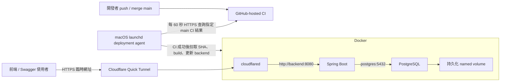

# 本機 Docker Compose＋Cloudflare Quick Tunnel 部署計劃

> **For agentic workers:** REQUIRED SUB-SKILL: Use superpowers:executing-plans to implement this plan task-by-task. Steps use checkbox (`- [ ]`) syntax for tracking. 本文件是規劃交付；尚未建立部署 workflow、安裝本機排程或啟動 tunnel。

**Goal:** 將 GitHub main 分支通過測試的後端版本，自動部署到自己的本機，並透過免費 Quick Tunnel 提供外部 HTTPS API。

**Architecture:** public GitHub repository 使用 GitHub-hosted runner 執行 CI；macOS 本機的 launchd deployment agent 每 60 秒查詢 main 最新 commit 對應的指定 CI workflow，成功才拉取該 SHA、在本機再次驗證並建立 Docker image，更新固定 Compose project 的 backend。PostgreSQL 與 cloudflared 在同一組 Compose 網路持續運作；Quick Tunnel 僅傳送外部 API 請求，部署命令不走 tunnel。

**Tech Stack:** GitHub Actions ubuntu-latest runner、macOS launchd、GitHub CLI、Docker Compose V2、Java 26、Spring Boot 4.1.1、Gradle Wrapper 9.5.1、PostgreSQL 17.6、cloudflared。

**Spec:** [後端產品規格](../../../backend/spec.md)，以及本文件的架構、部署與驗收約定。

## 假設與範圍

- 使用者已確認 macOS 本機、public GitHub repository，部署分支 main。
- 本機需保持開機、連網，Docker engine 與 launchd agent 均需運作；不必開放任何 inbound 部署 port。
- 這次部署 backend、postgres、cloudflared；frontend 的功能開發與正式前端部署不包含在執行範圍。
- Quick Tunnel 無固定網址、無 SLA、不支援 SSE，最多 200 個同時處理中的請求。現有後端使用 202＋job 輪詢，符合此模式。
- 後端、PostgreSQL、Quick Tunnel 和 deployment agent 同機；不使用雲端 VM、SSH 部署、公開 webhook endpoint、self-hosted runner 或映像 registry。
- 主機電費、網路、OpenAI API 另計；public repo 的標準 GitHub-hosted runner 目前免費。第一階段不上傳 Actions artifact，以免產生額外儲存需求。
- 更新容器會有短暫中斷；這個 POC 不要求零停機。
- 現有應用沒有登入／權限機制，知道 tunnel URL 的人可以操作 API；只在展示需要時開啟 tunnel。CORS 只控制瀏覽器跨來源行為，不是 API 存取權限。

## 現有程式與需要新增的檔案

2026-09-12 檢閱時：backend/compose.yaml 只有 postgres、named volume 和 localhost 5432；backend/build.gradle 已有 test、integrationTest、bootJar；Flyway 在應用啟動時執行。backend/README.md 已說明 JDBC、AI 和 CORS 設定。以上部分檔案目前未提交，實作時以當時實際版本為準，不覆寫其他工作。

| 檔案 | 用途 |
|---|---|
| backend/Dockerfile | 將已通過測試的 bootJar 包成 Java 26 runtime image |
| backend/.dockerignore | 排除 .env、Gradle cache、Git 與非必要原始檔；保留 build/libs 的應用 jar |
| deploy/compose.yaml | POC 的 backend、postgres、cloudflared，固定 project 與資料 volume |
| deploy/compose.ci.yaml | 單獨的測試 PostgreSQL，固定 localhost 15432，獨立 volume |
| deploy/.env.example | POC 設定範本，不含真實金鑰 |
| deploy/.gitignore | 忽略 .env、state/、backups/；真實運行資料仍放在 checkout 外 |
| deploy/scripts/verify.sh | 單元／整合測試和 bootJar，輸出可打包的 jar |
| deploy/scripts/deploy.sh | 建置 image、備份、替換 backend、健康檢查、失敗回復、版本紀錄 |
| deploy/scripts/tunnel-url.sh | 取得目前 tunnel URL，輸出到本機 state，不開新 tunnel |
| deploy/scripts/poll-deploy.sh | 查詢指定 repo／workflow 的 main CI 狀態，拉取受信任 SHA，觸發本機部署 |
| deploy/com.seax.poc-deploy.plist.example | launchd 每 60 秒執行 poll-deploy 的範本 |
| .github/workflows/backend-ci.yml | PR、main push 和手動觸發 CI；不具有本機部署權限 |
| backend/README.md | 補上容器部署與 health/readiness 說明 |
| deploy/README.md | 主機初始化、launchd、網址更新、備份與回復操作 |
| backend/src/main/java/com/seax/backend/ReadinessController.java | 新增 GET /readyz，以 SELECT 1 驗證資料庫可用；成功 200，失敗 503，不輸出內部錯誤 |
| backend/src/test/java/com/seax/backend/ReadinessControllerTest.java | 驗證資料庫成功／失敗對應 200／503 |

## 架構與選項



1. **推薦並採用：public repo＋GitHub-hosted CI＋本機 polling agent。** PR 在 GitHub 測試，部署只拉取受信任 main；不需 registry 或 inbound 部署接口，通常在 CI 完成後 60 秒內開始本機工作。
2. **GitHub-hosted CI＋另外的 private deployment repo runner。** 可縮短觸發延遲，但需第二個 repo、跨 repo token 和額外維護；本次不採用。
3. **GitHub-hosted CI＋手動本機部署。** 最少自動化，只適合偶爾展示；本次要求自動部署，保留為排程故障時的操作方式。

main 需要限制誰能合併／push；本機最終仍會執行 main 的 build code。PR CI 通過不能直接觸發部署，也不下載 PR artifacts 或執行 fork 的程式到本機。

## Compose 與設定約定

- POC project 固定為 seax-poc，資料 volume 固定為 seax-poc-postgres-data，避免 checkout 路徑變動產生另一個空資料庫。
- backend image 為 seax-backend:<完整 commit SHA>；禁止只用 latest 表示部署版本。
- postgres 沿用 17.6；資料目錄掛 /var/lib/postgresql/data，POC compose 不對 host 公開 5432。
- backend 只綁 127.0.0.1:8080:8080，供本機健康檢查；cloudflared 經 Compose network 連到 http://backend:8080。
- postgres healthcheck 用 pg_isready；backend 等 postgres healthy 後啟動，backend healthcheck 用 GET /readyz。
- runtime image 需包含健康檢查所用的 HTTP client，不能假設 Java base image 已有 curl。
- cloudflared command 為 tunnel --no-autoupdate --url http://backend:8080；首次實作時選擇官方可取得的 release image 並記錄 digest，backend 的 Java 26 base image 同樣記錄 digest。
- 三個服務使用 restart: unless-stopped；這不會自動啟動尚未運作的 Docker Desktop。
- backend 開啟 graceful shutdown，timeout 130 秒；Compose stop_grace_period 設 140 秒。現有 durable job 仍依 PostgreSQL 租約／中斷恢復邏輯處理未完成任務，重啟可能造成 AI 呼叫重試與額外費用，不能宣稱 exactly-once。
- 固定 runtime 資料夾使用本機 $HOME/seax-poc-runtime；使用 $HOME/seax-poc-source 作獨立 deployment checkout，不使用日常開發工作目錄。checkout 不保存真實 .env、備份、deployment state。
- runtime .env 權限設 600，設定如下：DATABASE_URL=jdbc:postgresql://postgres:5432/seax、DATABASE_USERNAME=seax、非範例 DATABASE_PASSWORD、OPENAI_API_KEY、OPENAI_MODEL、PORT=8080、CORS_ALLOWED_ORIGINS、SEED_GLOBAL_MEMORY、WORKER_ENABLED。
- runtime compose、polling 與部署 scripts 在首次設定時複製到固定 runtime 位置；一般更新只替換 backend image，compose／infra／deployment agent 變動需要手動套用，不把 GitHub checkout 路徑當作服務的永久來源。
- 測試資料庫 project 固定 seax-ci，port 15432，帳密僅供測試；TEST_DATABASE_URL=jdbc:postgresql://localhost:15432/seax。不能使用 POC runtime .env 執行測試。

## GitHub 觸發與部署流程

| 事件 | 行為 |
|---|---|
| push / merge 到 main | GitHub CI 測試；本機 agent 發現相同 SHA 的指定 CI 成功後部署 |
| Actions → Run workflow，選 main | 重新測試目前 main；尚未部署的 SHA 成功後被本機部署 |
| PR | GitHub-hosted CI 測試，不部署 |
| 其他 branch push／手動選其他 branch | 不自動部署；agent 只處理 main |
| 本機 offline／睡眠 | GitHub CI 正常執行；本機恢復後只部署最新 main 中通過指定 CI 的 SHA |

Workflow 約定：runs-on: ubuntu-latest，permissions: contents: read，timeout-minutes: 30；push 限 main，另加 pull_request、workflow_dispatch。不加 paths filter，確保每個 main SHA 都有可供 polling 判斷的 CI 結果；concurrency 以事件／分支或 PR 分組，cancel-in-progress: true 僅取消過時 CI，不取消已開始的本機部署。使用 Java 26 執行 test、integrationTest、bootJar，GitHub runner 啟動獨立 PostgreSQL 17.6，AI 使用測試 stub。CI 不保存 OpenAI key、local .env 或本機 GitHub token。

本機 poll-deploy.sh 使用 gh api 查詢設定好的 repo 和 backend-ci.yml workflow ID，讀取 refs/heads/main 的完整 SHA，限定 head_sha、head_branch=main、event=push 或 workflow_dispatch；取該 SHA 最新一筆符合條件的 run，只有 status=completed 且 conclusion=success 才部署。失敗、pending、cancelled、API 錯誤都不部署；重試失敗的 run 不得被先前成功 run 掩蓋。本機 gh 使用使用者自行初始化的唯讀認證，僅需讀取該 public repo、workflow runs；不在 workflow 寫入 token。

查詢介面示意（變數由本機設定／API 結果提供）：

```sh
gh api "repos/$SEAX_GITHUB_REPO/git/ref/heads/main" --jq '.object.sha'
gh api --method GET \
  "repos/$SEAX_GITHUB_REPO/actions/workflows/backend-ci.yml/runs" \
  -f branch=main -f head_sha="$SEAX_COMMIT_SHA" -f per_page=100
```

不可在 API query 加 status=success 後直接選第一筆，否則會忽略較新的失敗／進行中 run。符合事件的最新 run 以 run_number 選取，同一 run 的重新執行再檢查 run_attempt 與最新狀態。

agent 先取得本機 mkdir lock，再 polling／checkout／verify／deploy，鎖涵蓋測試 DB 和整個部署流程；主動取得最新 main SHA，部署前再比對，過時 SHA 不換版。當 deployed-sha 等於目前 SHA 時不重複部署。state/failed-sha 記錄本機 build／deploy 失敗的 SHA，避免每 60 秒無限重試；主機／API 暫時離線不記 failed-sha。失敗的同 SHA 需手動清除 failed-sha 再重試。

1. CI 使用 checkout 該 run SHA；官方 actions 固定到已核對的 commit SHA、persist-credentials: false。CI 成功後由本機 agent fetch 指定 main，核對 CI 成功 SHA 是目前 main head，再將獨立 deployment checkout 切到該 SHA；不 reset 日常開發目錄。
2. 本機檢查 runtime 路徑、Docker、Compose、Java 26、GitHub CLI、磁碟空間和 runtime .env；launchd 明確設定工具 PATH，不列印 .env 或 docker inspect。
3. 啟動 seax-ci PostgreSQL 並等待 healthy，執行 backend/gradlew test integrationTest bootJar，設定測試專用 TEST_DATABASE_*；AI 測試使用現有 stub，不提供真實 OPENAI_API_KEY。
4. 成功後停掉測試服務並保留其獨立 volume；失敗也執行清理，只操作 seax-ci。任何 test / build 失敗都不更動現有 backend。
5. 用已打包 jar 建立 seax-backend:<SHA>；確認只有一個可執行應用 jar，排除 plain jar，不將 .env 加進 image。
6. 再確認 main 最新 SHA。排程持有全流程 lock；手動 deploy.sh 也使用同一把 lock，既有 lock 則回報 busy，trap 釋放。內部呼叫以繼承的 SEAX_DEPLOY_LOCK_PID 核對 owner PID，避免重複取鎖；不能只用任意旗標略過 lock。
7. 首次部署前啟動 postgres；已有資料時先用 pg_dump -Fc 產出 runtime/backups/<UTC時間>-<SHA>.dump，備份失敗即停止，不替換 backend。
8. 保存 previous image、compose 設定版本；只更新 backend，執行 docker compose up -d --no-deps --wait --wait-timeout 180 backend。所有 POC 命令固定 -p seax-poc、-f runtime/compose.yaml、--env-file runtime/.env，backend image 用單獨 BACKEND_IMAGE env 傳入。
9. 健康檢查成功，再以 GET /api/v1/global-memory 確認 API 與資料庫正常；使用 seed=true 的 POC 應回 200。失敗不記錄成功版本。
10. 寫入 runtime/state/current-image、previous-image、deployed-sha、deployed-at；本機 log 記錄 CI run URL、SHA 和結果。GitHub Actions 顯示 CI 成功不代表本機已部署，部署狀態以本機 state 為準。
11. 首次啟動或 cloudflared 重啟後擷取目前 trycloudflare.com URL，保存 runtime/state/tunnel-url.txt；用 HTTPS GET /readyz 確認外部入口，不呼叫付費 AI。
12. cloudflared 不隨一般 backend deployment 重啟；外部檢查失敗時保留已 healthy 的 backend，本機 log 回報「本機已更新，外部入口失敗」，不盲目回復應用。

deploy/scripts 的執行介面固定：verify.sh 不需參數，在獨立 deployment repo root 執行；deploy.sh 接收完整 SHA 作為唯一位置參數，runtime 根目錄由 SEAX_RUNTIME_DIR 提供；tunnel-url.sh 使用同一 SEAX_RUNTIME_DIR，成功 stdout 只輸出 URL，失敗回 nonzero。deploy.sh 只接受 40 字元十六進位 SHA，成功退出 0，busy／build／backup／local readiness 失敗退出 nonzero。poll-deploy.sh 不需參數，設定 SEAX_GITHUB_REPO（owner/repo）、SEAX_RUNTIME_DIR、SEAX_SOURCE_DIR，從 repo API 驗證身份和 workflow；沒有可部署版本正常退出 0，部署／驗證失敗退出 nonzero。

## 失敗、回復與網址處理

- 測試或 image build 失敗：舊服務與資料不動。
- PostgreSQL、migration 或 readiness 失敗：保留備份與診斷 log，對具有向後相容 migration 的版本切回 previous image，再驗證 readiness，原 deployment 仍回報失敗。
- Flyway 不會因切回舊 image 自動回復 schema。每個 migration 必須先檢查舊版相容性；不能相容的更新使用手動 maintenance、備份與 restore，不納入自動 rollback。
- 首次部署沒有 previous image：停止失敗 backend，保留 postgres、資料與 log，修正後重新部署。
- image 與備份第一階段不自動刪除；保留 current、previous，確認需要更多容量時依版本紀錄手動清理。
- 禁止部署使用 docker compose down -v、docker volume prune、docker system prune --volumes 或資料庫初始化覆蓋既有資料。
- 後端容器替換期間 Quick Tunnel URL 通常維持；cloudflared 或 Docker／主機重啟後 URL 可能變更，必須重新取得。URL script 限定目前 cloudflared 啟動時間之後的 logs，不能拿歷史 log 的舊 URL；找不到新 URL 就失敗，不自動新開 tunnel。
- 網址預設只放本機檔案，不公開寫到 repo／public Actions log，因現有 API 沒有存取權限。
- 前端 CORS_ALLOWED_ORIGINS 設的是前端頁面的 origin，而不是 tunnel 的 backend URL；前端打 HTTPS URL，避免 mixed content。
- frontend 現在為 Next.js 靜態 export。若之後採 NEXT_PUBLIC_API_BASE_URL，修改網址需重新 build／部署前端；POC 建議在後續前端任務加入可由使用者設定並保存 localStorage 的 API base URL，tunnel 換網址只更新設定。這是前端介面決策，未包含其程式實作。

## 執行任務與驗收

### Task 1：可打包的 backend 與資料庫 readiness

- [ ] 新增 ReadinessController 與測試，以 JDBC SELECT 1 檢查成功 200／失敗 503，不依賴 OpenAI。
- [ ] 執行 backend/gradlew test，確認 readiness 與既有單元測試通過。
- [ ] backend/gradlew bootJar，新增 Dockerfile 和 .dockerignore，確認 image 為 Java 26、應用 jar 唯一、無真實設定。
- [ ] 加入 graceful shutdown 設定；更新 backend/README.md。

交付：可從 jar 建置 image，容器提供 /readyz，DB 不可用時不能被判為 ready。

### Task 2：固定 Compose runtime 與測試隔離

- [ ] 建立 deploy/compose.yaml、deploy/compose.ci.yaml、.env.example 和 .gitignore，遵守本文件 project、port、volume 約定。
- [ ] 首次手動準備 $HOME/seax-poc-runtime、.env、state/、backups/，複製 runtime compose。
- [ ] 使用 docker compose config --quiet 驗證兩組 compose，不輸出展開後的機密。
- [ ] 手動啟動 postgres 和 backend，檢查 /readyz、/api/v1/global-memory。
- [ ] 寫入一筆無付費呼叫的測試資料／查詢 seed，替換 backend，確認資料仍在且 PostgreSQL container 未被替換。
- [ ] 啟動測試 DB，確認 15432 與 POC volume 相互獨立。

交付：本機容器可啟動，換 backend 不丟資料，CI 不碰 POC DB。

### Task 3：Quick Tunnel 與入口驗證

- [ ] 啟動 cloudflared，建立 tunnel-url.sh，取得目前 URL 並保存本機檔案。
- [ ] 外部 HTTPS GET /readyz、開 Swagger 並執行讀取 API，確認不需 router port forwarding。
- [ ] 只換 backend，驗證 cloudflared container ID 與 URL 不變。
- [ ] 單獨重啟 cloudflared，重新取得 URL，確認 script 不讀取歷史網址。
- [ ] 文件說明前端 URL／CORS 更新方式、SSE 限制與停用 tunnel 的操作。

交付：可由外部讀取本機 API，網址變動可明確處理。

### Task 4：部署 script、備份與回復

- [ ] 建立 verify.sh，啟動測試 DB，執行 test、integrationTest、bootJar，trap 停測試服務。
- [ ] 建立 deploy.sh，實作 SHA 驗證、mkdir lock、image build、pg_dump、只換 backend、readiness 和 state。
- [ ] 手動部署兩個 image 版本，查資料確認版本更新沒有清空 DB。
- [ ] 用健康檢查必定失敗的候選 image 驗證 previous image 回復、失敗狀態與 lock 釋放。
- [ ] 用兩個同時手動呼叫驗證第二個回 busy，不發生交錯換版。
- [ ] 將備份還原到獨立測試 DB，確認可讀取表與資料；不可用 POC DB 做 restore 演練。

交付：部署成功可追溯，候選失敗可回復，備份可還原。

### Task 5：GitHub CI、macOS 排程與觸發

- [ ] 把專案上傳 GitHub，確認 default branch 是 main、repo 為 public，保護 main：限制寫入者、合併前要求 backend CI 成功；不註冊本機 self-hosted runner。
- [ ] 建立 backend-ci.yml，使用標準 hosted runner 和測試 PostgreSQL，套用 events、permissions、concurrency，核對 Java 26 安裝與測試結果。
- [ ] 本機安裝 gh、初始化唯讀認證，建立獨立 deployment clone 和固定 runtime，設定 repo／workflow ID；不把 gh 認證放進 GitHub 或專案。
- [ ] 建立 poll-deploy.sh，實作限定 main／SHA／workflow／事件／最新 run 的成功檢查、版本 state、防重試和全流程 lock。
- [ ] 建立 launchd plist 範本，以 StartInterval=60、RunAtLoad=true 排程，指定程式、工作目錄、PATH、環境與 log 絕對路徑。將使用者實際 home 寫入安裝後 plist，launchd 不會展開範本中的 $HOME。
- [ ] 使用 launchctl bootstrap gui/<UID> <plist絕對路徑> 啟用，launchctl kickstart gui/<UID>/com.seax.poc-deploy 立即檢查；部署／測試中不能再開第二個 agent。
- [ ] workflow_dispatch 選 main：先驗證 CI 成功後本機部署，再 push backend commit 驗證自動部署。已部署 SHA 不重複換版，同 SHA 需要重部署時手動執行 deploy.sh。
- [ ] 開 PR／fork PR，確認只在 hosted runner 測試；main CI 失敗、pending、cancelled，確認本機不換版。
- [ ] 停用 agent 後 push，再恢復並核對部署最新 SHA；連續兩次 push，確認過時版本被略過。

交付：public GitHub CI 與本機 CD 分離，push 可間接觸發部署，無 inbound 部署 port。

### Task 6：交接與完整展示

- [ ] deploy/README.md 收錄首次初始化、runtime .env、launchd 日常檢查、目前 SHA／URL、failed-sha 重試、備份、schema 限制與回復。
- [ ] 確認只提交範本與程式，不提交 .env、gh 認證、state、backups；不覆寫本機其他未提交工作。
- [ ] 重啟 Docker／主機後檢查 engine、launchd、三個服務，重新取得 URL，不宣稱尚未登入時 Docker Desktop 一定自動恢復。
- [ ] 使用測試 AI 回應完成 create → polling → report → edit → close 演練；真實 OpenAI 展示另行使用已配置的 key/model。

交付：開發者能從 GitHub 更新版本，也能辨識是 CI、deployment agent、應用、資料庫還是 tunnel 故障。

## 官方參考（查核於 2026-09-12）

- [GitHub-hosted runner：標準 runner 環境](https://docs.github.com/en/actions/reference/runners/github-hosted-runners)
- [GitHub Actions 觸發事件：push、workflow_dispatch](https://docs.github.com/en/actions/reference/workflows-and-actions/events-that-trigger-workflows)
- [GitHub Actions workflow syntax：permissions、runs-on、concurrency](https://docs.github.com/en/actions/reference/workflows-and-actions/workflow-syntax)
- [GitHub Actions REST API：按 workflow、SHA、branch、event 查詢 runs](https://docs.github.com/en/rest/actions/workflow-runs#list-workflow-runs-for-a-workflow)
- [Apple launchd job 設定與定期執行](https://developer.apple.com/library/archive/documentation/MacOSX/Conceptual/BPSystemStartup/Chapters/CreatingLaunchdJobs.html)
- [GitHub Actions 安全：不受信任程式與 public repo runner 風險](https://docs.github.com/en/actions/reference/security/secure-use)
- [GitHub Actions 計費：public repo 標準 hosted runner 免費](https://docs.github.com/en/billing/concepts/product-billing/github-actions)
- [Cloudflare Quick Tunnel：臨時網址、200 concurrency、無 SSE／SLA](https://developers.cloudflare.com/cloudflare-one/networks/connectors/cloudflare-tunnel/do-more-with-tunnels/trycloudflare/)
- [Docker Compose up：保留掛載 volume、--no-deps、--wait](https://docs.docker.com/reference/cli/docker/compose/up/)
